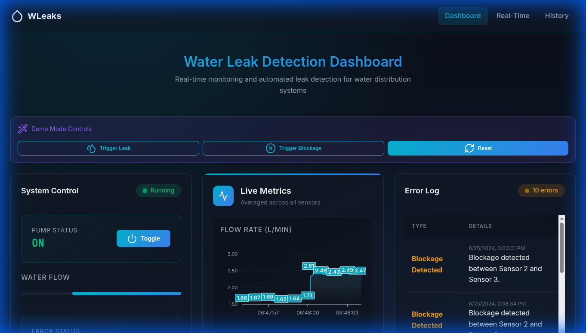
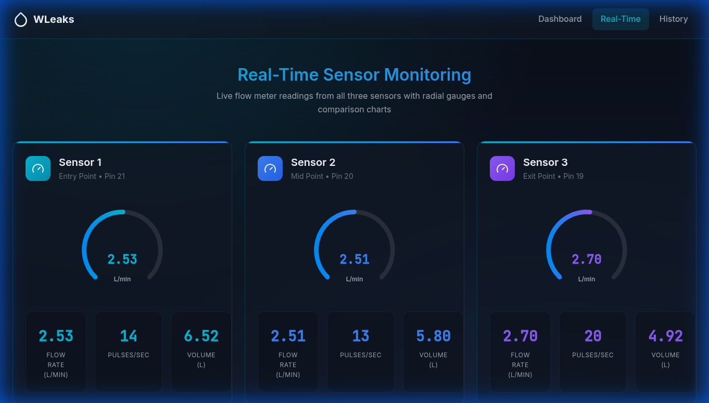
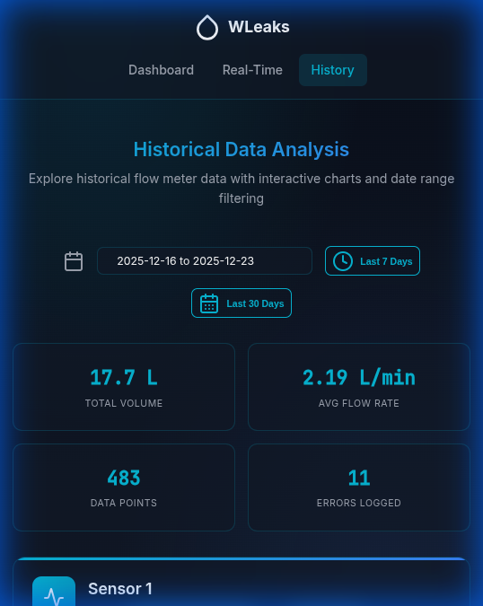
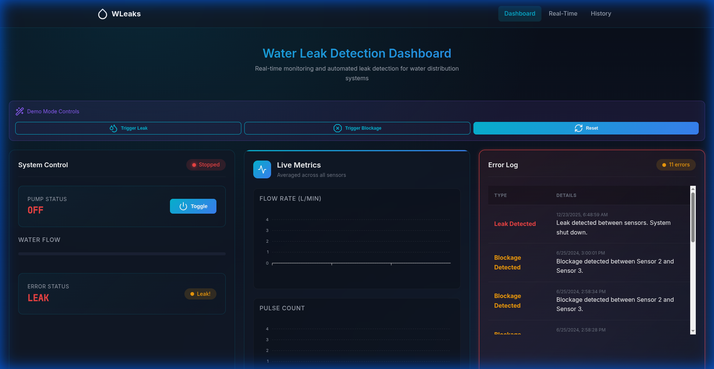

# 💧 WLeaks - IoT Water Leak Detection System

<p align="center">
  
  
  
  
  
</p>

<p align="center">
  <strong>Real-time water leak detection and automated pump shutoff system using flow meter sensors</strong>
</p>

<p align="center">
  <a href="#-live-demo">🌐 Live Demo</a> •
  <a href="#-features">✨ Features</a> •
  <a href="#-how-it-works">🔧 How It Works</a> •
  <a href="#-tech-stack">🛠 Tech Stack</a> •
  <a href="#-quick-start">🚀 Quick Start</a>
</p>

---

## 🎯 Problem Statement

Water leaks in residential and commercial buildings cause billions in damages annually. Traditional leak detection methods are reactive — damage is often done before detection. This project implements a **proactive, real-time monitoring system** that:

- Detects leaks **within 3 seconds** by comparing flow rates across multiple sensors
- **Automatically shuts off** the water pump to prevent damage
- Logs all events for analysis and maintenance planning

## 🌐 Live Demo

> **[▶️ Try the Interactive Demo](#)** — Simulates real sensor data without hardware

The demo mode allows you to:
- Trigger simulated **leak** and **blockage** scenarios
- Watch real-time charts respond to changing flow rates
- See the automated safety shutoff in action

---

## ✨ Features

| Feature | Description |
|---------|-------------|
| 🔴 **Leak Detection** | Compares flow rates between sensors; triggers alert if >50% difference persists for 3+ seconds |
| 🟠 **Blockage Detection** | Detects near-zero flow at exit sensor for 5+ seconds while pump is running |
| ⚡ **Auto Shutoff** | Sends signal to Arduino to stop pump immediately when leak/blockage detected |
| 📊 **Real-Time Dashboard** | Live charts with ApexCharts, glassmorphism UI, dark ocean theme |
| 📈 **Historical Analysis** | Date-range filtering, cumulative volume tracking, error log history |
| 🎮 **Demo Mode** | Full simulation without hardware for portfolio demos and testing |
| 🐳 **Docker Ready** | One-command deployment with Docker Compose |

---

## 🔧 How It Works

```
┌─────────────┐    Serial    ┌─────────────┐   WebSocket   ┌─────────────┐
│   Arduino   │◄────────────►│   Node.js   │◄─────────────►│   Browser   │
│   Mega/Uno  │   115200bps  │   Server    │   Socket.IO   │  Dashboard  │
└──────┬──────┘              └──────┬──────┘               └─────────────┘
       │                            │
   Flow Meters                  SQLite DB
   (3 sensors)              (historical data)
```

### Detection Algorithm

1. **Three flow meters** positioned at entry, middle, and exit points
2. Server calculates flow rate: `(pulses/calibration_factor) × 60 = L/min`
3. **Leak Detection**: If `|Sensor1 - Sensor2| > 50% × Sensor1` for 3+ seconds → LEAK
4. **Blockage Detection**: If `Sensor3 < 0.1 L/min` while system ON for 5+ seconds → BLOCKAGE
5. On detection: Arduino receives `'P'` command → pump relay toggles OFF

---

## 🖥 Screenshots

<table>
  <tr>
    <td></td>
    <td></td>
  </tr>
  <tr>
    <td align="center"><strong>Main Dashboard</strong></td>
    <td align="center"><strong>Real-Time Monitoring</strong></td>
  </tr>
  <tr>
    <td></td>
    <td></td>
  </tr>
  <tr>
    <td align="center"><strong>Historical Analysis</strong></td>
    <td align="center"><strong>Leak Detection Alert</strong></td>
  </tr>
</table>

---

## 🛠 Tech Stack

### Hardware Components

| Component | Specifications |
|-----------|---------------|
| **Arduino Mega 2560** | ATmega2560 microcontroller, 54 digital I/O pins, 16 analog inputs |
| **YF-S201 Flow Meters (×3)** | Hall-effect sensor, 1-30 L/min range, G1/2" thread, pulse output |
| **12V DC Submersible Water Pump** | 12V DC, 1.8A working current, 12L/min flow rate, 8500 RPM, stainless steel, 16mm tubing diameter |
| **5V Relay Module** | Optocoupler isolated, 10A/250VAC rated, for pump control |
| **ATX PSU (Modified)** | Repurposed computer PSU, 12V rail for pump, 5V rail for electronics |
| **LM2596 DC-DC Buck Converters** | Adjustable output, 3A max, for voltage regulation |
| **16mm Silicone Tubing** | Food-grade, flexible, connects pump to flow meters |
| **Various Jumper Wires** | Male-to-male, male-to-female connections |

### Water Pump Specifications
```
Voltage: 12V DC
Working Current: 1.8A @ 12V
Flow Rate: 12 L/min (standard), up to 32 L/min (51mm outlet)
Motor Speed: 8500 RPM
Outer Diameter: 51mm / 38mm options
Tubing Diameter: 16mm
Wire Length: 3m
Material: Stainless Steel
```

### Software
- **Node.js + Express** — REST API server
- **Socket.IO** — Real-time WebSocket communication
- **SQLite** — Lightweight database
- **ApexCharts** — Modern interactive charts
- **Custom CSS** — Glassmorphism dark ocean theme

---

## 🚀 Quick Start

### Option 1: Docker (Recommended)

```bash
# Clone the repository
git clone https://github.com/yourusername/wleaks.git
cd wleaks

# Start with Docker Compose
docker-compose up -d

# Open browser
open http://localhost:3000
```

### Option 2: Local Development

```bash
# Install dependencies
npm install

# Run in demo mode (no hardware needed)
DEMO_MODE=true npm start

# Open browser
open http://localhost:3000
```

### Option 3: With Hardware

```bash
# Ensure Arduino is connected on the correct port
# Edit server.js line 69 if needed: path: 'COM15' → your port

npm start
```

---

## 📡 API Endpoints

| Endpoint | Method | Description |
|----------|--------|-------------|
| `/system/state` | GET | Get current pump status (ON/OFF) |
| `/system/switch` | POST | Toggle pump state |
| `/detection_status` | GET | Get leak/blockage detection status |
| `/realtime/flow_rates/:id` | GET | Get real-time flow rate for sensor |
| `/history/flow_rates/:id` | GET | Get historical flow rates with date filtering |
| `/errors` | GET | Get error log entries |
| `/demo/trigger-leak` | POST | Trigger simulated leak (demo mode only) |
| `/demo/trigger-blockage` | POST | Trigger simulated blockage (demo mode only) |
| `/demo/reset` | POST | Reset demo to normal operation |

---

## 🔌 Hardware Wiring

```
Arduino Mega 2560
├── Pin 21 ─── Flow Meter 1 (Entry)
├── Pin 20 ─── Flow Meter 2 (Middle)  
├── Pin 19 ─── Flow Meter 3 (Exit)
├── Pin 5  ─── Push Button / Relay Control
├── 5V     ─── Sensor VCC (via DC-DC converter)
└── GND    ─── Common Ground

ATX PSU (Modified)
├── Yellow (12V) ─── Pump Motor
├── Red (5V)     ─── DC-DC Converter Input
└── Black (GND)  ─── Common Ground
```

---

## 📊 Database Schema

```sql
-- Sensor readings
pulses (id, timestamp, sensor_id, pulse_count)
flow_rates (id, timestamp, sensor_id, flow_rate)
volumes (id, timestamp, sensor_id, volume)

-- Aggregated data
median_pulses (id, timestamp, median_pulse_count)
median_flow_rates (id, timestamp, median_flow_rate)
median_volumes (id, timestamp, median_volume)

-- System state
system_state (id, timestamp, state)
error_log (id, timestamp, error_type, details)
```

---

## 🎓 Skills Demonstrated

- **IoT Development** — Arduino, sensors, serial communication
- **Full-Stack Web** — Node.js, Express, REST APIs, WebSockets
- **Real-Time Systems** — Event-driven architecture, Socket.IO
- **Data Visualization** — ApexCharts, dynamic dashboards
- **UI/UX Design** — Glassmorphism, dark themes, responsive CSS
- **Problem Solving** — Leak detection algorithm, auto-safety systems
- **DevOps** — Docker containerization, environment configuration

---

## 👤 Author

**Billel Lamairia**

- LinkedIn: [linkedin.com/in/billel-lamairia-94141723b](https://www.linkedin.com/in/billel-lamairia-94141723b)
- Email: [blamairia@gmail.com](mailto:blamairia@gmail.com)
- Phone: +213 668 673 666

---

## 📄 License

This project is open source and available under the [MIT License](LICENSE).
